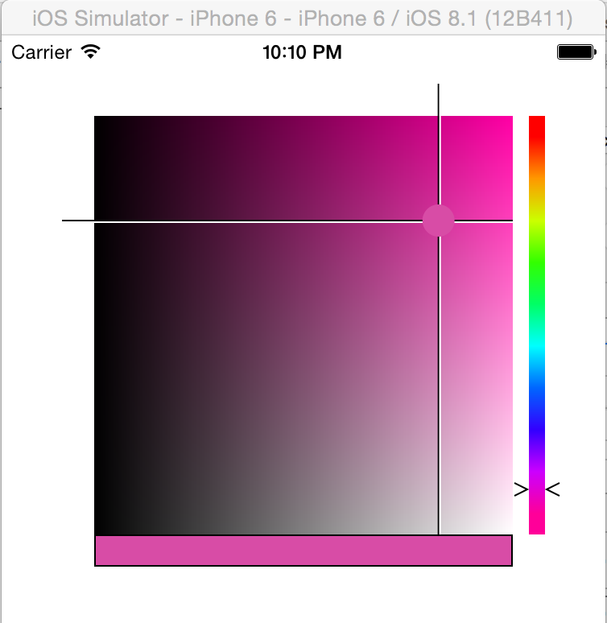
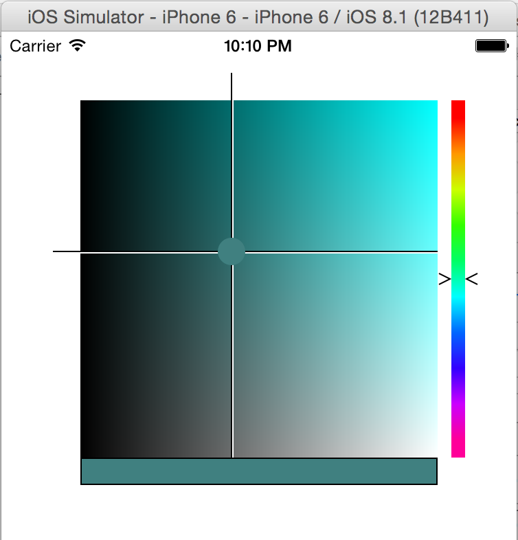

SwiftColorPicker
================

A Photoshop-like color picker for iOS devices implemented in Swift.

##How to use
Including the SwiftColorPicker in your application is fairly straightforward.
###Learning
Clone the repo, open the project in Xcode, and open the Main.stroyboard to see how to use the ColorPicker. You will notice that the ViewController has a subview with the ColorPicker class associated to it and that the ViewController has an @IBOutlet reference to the ColorPicker UIView. Next open ViewController.swift and you will notice that ColorPicker.setColor(color: UIColor) is called in the viewDidLoad method. This allows you to specify the color that the ColorPicker should initially show as the selected color (otherwise the ColorPicker will default to red as the selected color).
###Implementing
Copy lib/SwiftColorPicker into your project and associate the UIView: ColorPicker to the UIView that you would like the ColorPicker to live. The size/dimensions of the UIView that you use to init the ColorPicker will dictate the size of the ColorPicker.

##ToDo:
(Pull requests welcome)

1. Test modifying the size of the containing UIView to determine if the ColorPicker can handle it.
2. Provide better documentation all around.
3. Unit tests.
4. Possibly refactor to support auto-layout?